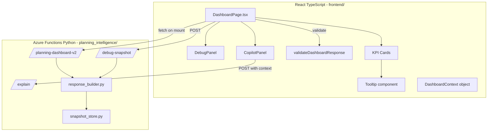

# Design Document: Dashboard Enhancements

## Overview

This document describes the technical design for five enhancement areas on the Planning Intelligence dashboard: end-to-end data validation (DebugPanel + `/debug-snapshot`), dynamic KPI tooltips, a Copilot chat side panel, improved backend Q&A via the `/explain` endpoint, and general UX polish.

The existing architecture is preserved: React TypeScript frontend with Tailwind CSS in `frontend/`, Azure Functions Python v2 backend in `planning_intelligence/`, blob-based daily refresh, and the `DashboardResponse` JSON contract between them.

### Key Design Decisions

- **No new routing**: CopilotPanel is a drawer overlay, not a new page route.
- **Tooltip as a wrapper**: A single reusable `Tooltip` component wraps each card rather than embedding tooltip logic per card.
- **Context-grounded explain**: The frontend sends a `DashboardContext` snapshot with every `/explain` call so the backend never needs to re-fetch for UI-driven queries.
- **Debug mode is purely additive**: `DebugPanel` is tree-shaken in production builds via the `REACT_APP_DEBUG_MODE` env flag; it adds no runtime cost when disabled.
- **Validation is non-blocking**: `validateDashboardResponse` logs warnings but never mutates or delays the render pipeline.

---

## Architecture



### Data Flow

1. `DashboardPage` fetches from `/planning-dashboard-v2` on mount.
2. The raw response is passed through `validateDashboardResponse` (logs warnings, no mutation).
3. State is set; cards render with optional `Tooltip` wrappers.
4. If `REACT_APP_DEBUG_MODE=true`, `DebugPanel` renders as a fixed overlay.
5. "Ask Copilot" opens `CopilotPanel`; each user message POSTs to `/explain` with a `DashboardContext` snapshot derived from current state.
6. `/debug-snapshot` is a separate POST endpoint that re-runs the analytics pipeline and returns intermediate values.

---

## Components and Interfaces

### Frontend Components

#### `Tooltip` — `frontend/src/components/Tooltip.tsx`

A generic wrapper component. Renders children normally; on hover (desktop) or tap of an ⓘ icon (touch), shows a floating panel.

```typescript
interface TooltipProps {
  content: React.ReactNode;   // tooltip body — data-driven, never hardcoded
  children: React.ReactNode;  // the wrapped card or element
}
```

**Behavior:**
- Desktop: CSS hover via `onMouseEnter`/`onMouseLeave` on the wrapper div.
- Touch: an `ⓘ` icon button rendered adjacent to the card title; tap toggles visibility.
- Positioning: absolute, above the card by default; flips below if near viewport top.
- Transition: `opacity` + `translateY` CSS transition, max 300ms.
- Styling: `background: #161b22`, `border: 1px solid rgba(255,255,255,0.1)`, `color: #e6edf3`, `border-radius: 8px`, `padding: 12px`, `z-index: 50`, `max-width: 320px`.
- Null safety: any `null`/`undefined` field renders as `"N/A"`.

#### `DebugPanel` — inline in `DashboardPage.tsx`

Rendered only when `process.env.REACT_APP_DEBUG_MODE === "true"`. Fixed overlay, bottom-right corner, collapsible.

**Sections when expanded:**
1. Raw JSON viewer — shows the fields: `planningHealth`, `forecastNew`, `forecastOld`, `trendDelta`, `trendDirection`, `changedRecordCount`, `totalRecords`, `riskSummary`, `dataMode`, `lastRefreshedAt`.
2. Card-to-field mapping table — static table mapping each UI card to its source field(s).
3. Calculation trace — HealthScore deduction breakdown, changed%, risk level derivation.
4. "Copy JSON" button — copies full `DashboardResponse` to clipboard.

**Card-to-field mapping table (static):**

| UI Card | Backend Field(s) |
|---|---|
| PlanningHealthCard | `planningHealth`, `status` |
| ForecastCard | `forecastNew`, `forecastOld`, `trendDelta`, `trendDirection` |
| TrendCard | `trendDirection`, `riskSummary`, `totalRecords`, `changedRecordCount` |
| SummaryTiles | `totalRecords`, `changedRecordCount`, `unchangedRecordCount`, `newRecordCount`, `datacenterCount` |
| RiskCard | `riskSummary` |
| AIInsightCard | `aiInsight` |
| RootCauseCard | `rootCause`, `drivers` |
| AlertBanner | `alerts` |

#### `CopilotPanel` — `frontend/src/components/CopilotPanel.tsx`

Right-side drawer. On screens ≥ 1024px it pushes the main layout (adds `pr-[400px]` to `<main>`); on smaller screens it overlays.

```typescript
interface ChatMessage {
  role: "user" | "assistant";
  content: string;
  timestamp: number;
}

interface CopilotPanelProps {
  isOpen: boolean;
  onClose: () => void;
  context: DashboardContext;   // snapshot of current dashboard state
}
```

**State:**
- `messages: ChatMessage[]` — initialized with a greeting message on open.
- `input: string` — controlled text field.
- `loading: boolean` — true while awaiting `/explain`.
- `error: string | null` — set on network error.

**Behavior:**
- Opens with a greeting assistant message summarizing `planningHealth`, `status`, `changedRecordCount`, `riskSummary.level`, and first 120 chars of `aiInsight`.
- Displays 4 starter prompts (clickable chips); clicking one populates and submits the input.
- Enter (without Shift) submits; Shift+Enter inserts newline.
- 6-second timeout: if `/explain` doesn't respond, shows timeout message, preserves input, allows retry.
- On error/timeout: constructs a fallback answer from `context.aiInsight`, `context.rootCause`, `context.recommendedActions`.
- Close button (×) hides panel; message history is preserved in component state for the session.
- "Ask Copilot" button in `ActionsPanel` gets a highlighted border (`border-blue-400`) when panel is open.

**Starter prompts logic:**
```typescript
function buildStarterPrompts(ctx: DashboardContext): string[] {
  const prompts = [
    "Why is planning health critical?",
    "What changed most?",
    "What should the planner do next?",
  ];
  if (ctx.drivers?.location) {
    prompts.push(`Why is ${ctx.drivers.location} driving the most changes?`);
  }
  return prompts;
}
```

#### KPI Card Tooltip Content

Each card receives a `Tooltip` wrapper in `DashboardPage.tsx`. The `content` prop is constructed inline from `data`:

| Card | Tooltip content fields |
|---|---|
| PlanningHealthCard | score, status band + threshold, `changedRecordCount/totalRecords`%, highest risk level, design count, supplier count, dominant deduction factor |
| ForecastCard | `forecastNew`, `forecastOld`, `trendDelta`, `trendDirection` |
| SummaryTiles (Changed tile) | `changedRecordCount`, `totalRecords`, changed% |
| RiskCard | `riskSummary.highestRiskLevel`, `highRiskCount`, `riskBreakdown` entries |
| AIInsightCard | primary evidence from non-null signals: `drivers`, `trendDirection`, `riskSummary.level`, changed ratio |
| RootCauseCard | `drivers.changeType`, `drivers.location`, `drivers.supplier`, `drivers.materialGroup`, `trendDirection` |
| AlertBanner | `alerts.severity`, `alerts.triggerType`, `alerts.recommendedAction` |

#### `validateDashboardResponse` — `frontend/src/services/validation.ts`

Pure function, no side effects on the data.

```typescript
export function validateDashboardResponse(data: unknown): data is DashboardResponse {
  // checks top-level required fields exist and have correct types
  // logs console.warn for each missing/mismatched field
  // returns true if all required fields present, false otherwise
  // never throws, never mutates data
}
```

Required fields checked: `dataMode`, `planningHealth`, `status`, `forecastNew`, `forecastOld`, `trendDirection`, `trendDelta`, `totalRecords`, `changedRecordCount`, `riskSummary`, `aiInsight`, `rootCause`, `recommendedActions`, `drivers`, `alerts`, `filters`.

#### Skeleton Loading

Replaces the spinner in `DashboardPage.tsx`. Three animated placeholder cards matching the grid layout, using `animate-pulse` Tailwind class with `bg-gray-800` fill.

#### Empty State

When `data.totalRecords === 0`, renders a centered message in place of all KPI cards:
```
No planning records available for the selected filters.
```

---

### Backend Endpoints

#### `POST /api/debug-snapshot`

New endpoint in `function_app.py`. Re-runs the full analytics pipeline and returns intermediate values.

**Request:**
```json
{
  "mode": "cached",          // "cached" | "live" | "blob" — optional, default "cached"
  "location_id": "LOC001",   // optional
  "material_group": "PUMP"   // optional
}
```

**Response:** `DebugSnapshotResponse`
```json
{
  "normalizedCount": 1200,
  "filteredCount": 340,
  "comparedCount": 340,
  "changedCount": 87,
  "healthScoreInputs": {
    "total": 340,
    "changed": 87,
    "riskCounts": { "Design Change Risk": 12, "Supplier Change Risk": 5 },
    "designCount": 12,
    "supplierCount": 5,
    "highestRisk": "Design Change Risk",
    "deductions": {
      "changeRatio": 10,
      "riskLevel": 15,
      "designPenalty": 10,
      "supplierPenalty": 10
    }
  },
  "dashboardResponse": { /* full DashboardResponse */ }
}
```

**Implementation:** Calls `normalize_rows → filter_records → compare_records → _compute_health_score` directly, capturing intermediate counts before calling `build_response`.

#### `POST /api/explain` (updated)

Accepts an optional `context` object. When present, uses it to ground the answer instead of re-fetching the snapshot.

**Updated request:**
```json
{
  "question": "Why did forecast increase?",
  "mode": "cached",
  "location_id": "LOC001",
  "context": {
    "planningHealth": 42,
    "status": "Critical",
    "forecastNew": 15000,
    "forecastOld": 12000,
    "trendDelta": 3000,
    "trendDirection": "Increase",
    "changedRecordCount": 87,
    "totalRecords": 340,
    "riskSummary": { "level": "HIGH", "highestRiskLevel": "Design Change Risk" },
    "aiInsight": "...",
    "rootCause": "...",
    "alerts": {},
    "drivers": { "location": "LOC001", "changeType": "Design" },
    "filters": {},
    "dataMode": "cached",
    "lastRefreshedAt": "2025-01-15T08:00:00Z"
  }
}
```

**Updated response:**
```json
{
  "question": "Why did forecast increase?",
  "answer": "Forecast increased by 3,000 units primarily due to design changes at LOC001...",
  "aiInsight": "...",
  "rootCause": "...",
  "recommendedActions": ["..."],
  "planningHealth": 42,
  "dataMode": "cached",
  "lastRefreshedAt": "2025-01-15T08:00:00Z",
  "supportingMetrics": {
    "changedRecordCount": 87,
    "totalRecords": 340,
    "trendDelta": 3000,
    "planningHealth": 42
  },
  "contextUsed": ["planningHealth", "trendDelta", "drivers", "aiInsight"]
}
```

**Validation:** Returns HTTP 400 `{"error": "question is required"}` if `question` is empty or missing.

**Backward compatibility:** Callers without `context` continue to work — falls back to snapshot load as before.

---

## Data Models

### `DashboardContext` — `frontend/src/types/dashboard.ts` (addition)

```typescript
export interface DashboardContext {
  planningHealth: number;
  status: HealthStatus;
  forecastNew: number;
  forecastOld: number;
  trendDelta: number;
  trendDirection: TrendDirection;
  changedRecordCount: number;
  totalRecords: number;
  riskSummary: {
    level: RiskLevel;
    highestRiskLevel: string;
  };
  aiInsight: string;
  rootCause: string;
  alerts: AlertPayload;
  drivers: {
    location: string | null;
    supplier: string | null;
    material: string | null;
    materialGroup: string | null;
    changeType: string;
  };
  filters: {
    locationId: string | null;
    materialGroup: string | null;
  };
  dataMode: DataMode;
  lastRefreshedAt: string;
}
```

### `ExplainRequest` / `ExplainResponse` — `frontend/src/types/dashboard.ts` (addition)

```typescript
export interface ExplainRequest {
  question: string;
  mode?: "live" | "cached";
  location_id?: string;
  material_group?: string;
  context?: Partial<DashboardContext>;
}

export interface ExplainResponse {
  question: string;
  answer: string;
  aiInsight: string;
  rootCause: string;
  recommendedActions: string[];
  planningHealth: number;
  dataMode: DataMode;
  lastRefreshedAt: string;
  supportingMetrics: {
    changedRecordCount: number;
    totalRecords: number;
    trendDelta: number;
    planningHealth: number;
  };
  contextUsed: string[];
}
```

### `DebugSnapshotResponse` — `frontend/src/types/dashboard.ts` (addition)

```typescript
export interface DebugSnapshotResponse {
  normalizedCount: number;
  filteredCount: number;
  comparedCount: number;
  changedCount: number;
  healthScoreInputs: {
    total: number;
    changed: number;
    riskCounts: Record<string, number>;
    designCount: number;
    supplierCount: number;
    highestRisk: string;
    deductions: {
      changeRatio: number;
      riskLevel: number;
      designPenalty: number;
      supplierPenalty: number;
    };
  };
  dashboardResponse: DashboardResponse;
}
```

### `ChatMessage` — `frontend/src/components/CopilotPanel.tsx` (local)

```typescript
interface ChatMessage {
  role: "user" | "assistant";
  content: string;
  timestamp: number;
}
```

---

## Correctness Properties

*A property is a characteristic or behavior that should hold true across all valid executions of a system — essentially, a formal statement about what the system should do. Properties serve as the bridge between human-readable specifications and machine-verifiable correctness guarantees.*

### Property 1: Debug snapshot response completeness

*For any* valid combination of `mode`, `location_id`, and `material_group` parameters sent to `/debug-snapshot`, the response SHALL contain all required fields: `normalizedCount`, `filteredCount`, `comparedCount`, `changedCount`, `healthScoreInputs` (with `total`, `changed`, `riskCounts`, `designCount`, `supplierCount`, `highestRisk`, `deductions`), and `dashboardResponse`.

**Validates: Requirements 1.1**

---

### Property 2: KPI card tooltip content completeness

*For any* valid `DashboardResponse`, each KPI card's Tooltip content SHALL contain all required fields for that card — specifically: PlanningHealthCard tooltip includes score, status band, changed%, highest risk level, design count, supplier count, and dominant deduction factor; ForecastCard tooltip includes `forecastNew`, `forecastOld`, `trendDelta`, `trendDirection`; SummaryTiles Changed tile tooltip includes `changedRecordCount`, `totalRecords`, and changed%; RiskCard tooltip includes `highestRiskLevel`, `highRiskCount`, and `riskBreakdown` entries; AIInsightCard tooltip includes at least one non-null signal from `drivers`, `trendDirection`, `riskSummary.level`, or changed ratio; RootCauseCard tooltip includes `drivers.changeType`, `drivers.location`, `drivers.supplier`, `drivers.materialGroup`, and `trendDirection`; AlertBanner tooltip includes `severity`, `triggerType`, and `recommendedAction`.

**Validates: Requirements 2.1, 2.2, 2.3, 2.4, 2.5, 2.6, 2.7, 2.8**

---

### Property 3: Tooltip content is data-driven

*For any* two distinct `DashboardResponse` objects that differ in at least one tooltip-relevant field, the rendered tooltip content for the corresponding card SHALL differ between the two responses — confirming no hardcoded placeholder text is used.

**Validates: Requirements 2.11**

---

### Property 4: Tooltip null field fallback

*For any* `DashboardResponse` where one or more tooltip-relevant fields are `null` or `undefined`, the rendered tooltip content SHALL display `"N/A"` for each such field rather than crashing or rendering an empty string.

**Validates: Requirements 2.12**

---

### Property 5: CopilotPanel initial state

*For any* `DashboardContext`, when the CopilotPanel is opened, the initial message history SHALL contain exactly one assistant message that references `planningHealth`, `status`, `changedRecordCount`, and `riskSummary.level` from the context, and the starter prompts SHALL include the 3 fixed prompts plus a location-specific prompt if and only if `drivers.location` is non-null.

**Validates: Requirements 3.3, 3.4**

---

### Property 6: CopilotPanel message history growth

*For any* sequence of user questions submitted to the CopilotPanel, each successful response from the ExplainEndpoint SHALL append exactly one new assistant `ChatMessage` to the history, so the message count grows by 2 per round-trip (one user message + one assistant message).

**Validates: Requirements 3.2, 3.8**

---

### Property 7: CopilotPanel history preserved on close

*For any* message history state in the CopilotPanel, closing the panel (triggering `onClose`) and re-opening it within the same session SHALL preserve the full message history unchanged.

**Validates: Requirements 3.11**

---

### Property 8: CopilotPanel sends context with every question

*For any* question string and `DashboardContext`, when the user submits a question, the POST request body sent to `/explain` SHALL contain both the `question` field and a `context` field whose values match the current `DashboardContext` state.

**Validates: Requirements 3.6**

---

### Property 9: Explain endpoint response contract

*For any* valid `/explain` request (with or without `context`), the response SHALL contain all required fields: `question`, `answer`, `aiInsight`, `rootCause`, `recommendedActions`, `planningHealth`, `dataMode`, `lastRefreshedAt`, `supportingMetrics` (with `changedRecordCount`, `totalRecords`, `trendDelta`, `planningHealth`), and `contextUsed`. When a `context` object is provided, the `supportingMetrics.planningHealth` value SHALL equal the `planningHealth` value from the provided context.

**Validates: Requirements 4.1, 4.2, 4.3, 4.4**

---

### Property 10: Explain endpoint backward compatibility

*For any* request to `/explain` that does not include a `context` field and uses `mode: "cached"`, the response SHALL be a valid `ExplainResponse` with all required fields populated — identical behavior to the pre-enhancement endpoint.

**Validates: Requirements 4.8**

---

### Property 11: validateDashboardResponse purity and correctness

*For any* input value passed to `validateDashboardResponse`: (a) the function SHALL NOT throw an exception, (b) the function SHALL NOT mutate the input object, (c) it SHALL return `true` for any object containing all required fields with correct types, and (d) it SHALL return `false` and emit at least one `console.warn` for any object missing one or more required fields.

**Validates: Requirements 6.4, 6.5**

---

### Property 12: Null-safe rendering with incomplete responses

*For any* `DashboardResponse` with one or more top-level fields missing or `null`, rendering `DashboardPage` SHALL NOT throw a runtime error; each affected KPI card SHALL render a graceful fallback (`"—"` or `"N/A"`) for the missing field.

**Validates: Requirements 6.2, 6.3**

---

### Property 13: Timestamp display

*For any* valid ISO 8601 timestamp string in `data.lastRefreshedAt`, the dashboard header SHALL display the timestamp formatted via `toLocaleString()` in the user's local timezone. When `lastRefreshedAt` is `null` or `undefined`, the header SHALL display the string `"Refresh pending"`.

**Validates: Requirements 5.5, 5.6**

---

## Error Handling

### Frontend

| Scenario | Handling |
|---|---|
| API fetch fails on mount | Falls back to mock data; shows error banner (existing behavior preserved) |
| API response missing fields | `validateDashboardResponse` logs warnings; cards render fallback values |
| API response is null/unparseable | "No planning data available" empty state |
| `totalRecords === 0` | Empty state message replaces KPI cards |
| `/explain` returns error | CopilotPanel constructs fallback answer from local `DashboardContext` |
| `/explain` times out (>6s) | Timeout message shown; user input preserved; retry available |
| Tooltip field is null | Renders `"N/A"` for that field |
| Clipboard API unavailable | "Copy JSON" button shows a brief error toast |

### Backend

| Scenario | Handling |
|---|---|
| `question` empty or missing in `/explain` | HTTP 400 `{"error": "question is required"}` |
| `context` provided but malformed | Ignored; falls back to snapshot |
| No cached snapshot for `/explain` cached mode | HTTP 404 `{"error": "No cached snapshot available."}` |
| `/debug-snapshot` blob load fails | HTTP 500 with error message |
| `/debug-snapshot` called with `mode: "live"` but no `current_rows` | HTTP 400 `{"error": "'current_rows' is required for live mode."}` |
| Analytics pipeline exception | HTTP 500 with error message; logged via `logging.exception` |

---

## Testing Strategy

### Dual Testing Approach

Both unit tests and property-based tests are required. They are complementary:
- Unit tests cover specific examples, integration points, and edge cases.
- Property tests verify universal correctness across randomized inputs.

### Property-Based Testing

**Library choices:**
- Python backend: `hypothesis` (already available in the ecosystem)
- TypeScript frontend: `fast-check`

**Configuration:** Each property test runs a minimum of 100 iterations.

**Tag format:** Each test is tagged with a comment:
`// Feature: dashboard-enhancements, Property N: <property_text>`

**Property test mapping:**

| Property | Test location | Library |
|---|---|---|
| P1: Debug snapshot completeness | `planning_intelligence/tests/test_debug_snapshot.py` | hypothesis |
| P2: KPI tooltip content completeness | `frontend/src/components/__tests__/Tooltip.test.tsx` | fast-check |
| P3: Tooltip content is data-driven | `frontend/src/components/__tests__/Tooltip.test.tsx` | fast-check |
| P4: Tooltip null field fallback | `frontend/src/components/__tests__/Tooltip.test.tsx` | fast-check |
| P5: CopilotPanel initial state | `frontend/src/components/__tests__/CopilotPanel.test.tsx` | fast-check |
| P6: Message history growth | `frontend/src/components/__tests__/CopilotPanel.test.tsx` | fast-check |
| P7: History preserved on close | `frontend/src/components/__tests__/CopilotPanel.test.tsx` | fast-check |
| P8: Context sent with question | `frontend/src/components/__tests__/CopilotPanel.test.tsx` | fast-check |
| P9: Explain response contract | `planning_intelligence/tests/test_explain_endpoint.py` | hypothesis |
| P10: Explain backward compatibility | `planning_intelligence/tests/test_explain_endpoint.py` | hypothesis |
| P11: validateDashboardResponse purity | `frontend/src/services/__tests__/validation.test.ts` | fast-check |
| P12: Null-safe rendering | `frontend/src/pages/__tests__/DashboardPage.test.tsx` | fast-check |
| P13: Timestamp display | `frontend/src/pages/__tests__/DashboardPage.test.tsx` | fast-check |

### Unit Tests

Unit tests focus on specific examples, integration points, and edge cases not covered by property tests:

**Frontend:**
- `DebugPanel` renders when `REACT_APP_DEBUG_MODE=true`, absent otherwise (Req 1.2, 1.6)
- "Copy JSON" button present when DebugPanel open (Req 1.4)
- Card-to-field mapping table present in DebugPanel (Req 1.7)
- ⓘ icon renders and toggles tooltip on touch (Req 2.13)
- "Ask Copilot" click opens CopilotPanel (Req 3.1)
- Text input and Send button present in CopilotPanel (Req 3.5)
- Loading indicator shown while awaiting response (Req 3.7)
- Timeout message shown after 6s with input preserved (Req 3.10)
- "Ask Copilot" button highlighted when panel open (Req 3.13)
- Skeleton loading renders when `loading=true` (Req 5.1)
- Empty state renders when `totalRecords=0` (Req 5.2)
- `/explain` fallback to snapshot when no context (Req 4.5)
- HTTP 400 on empty question (Req 4.6)
- Empty state on null API response (Req 6.6)

**Backend:**
- `_compute_health_score` returns 100 for empty records
- `_compute_health_score` clamps to [0, 100]
- `/debug-snapshot` returns correct intermediate counts for known input
- `/explain` with context uses context planningHealth in supportingMetrics
- `/explain` without context falls back to snapshot

### Test Data Strategy

- Frontend: `fast-check` arbitraries for `DashboardResponse`, `DashboardContext`, `ChatMessage[]`, and partial/null response shapes.
- Backend: `hypothesis` strategies for `ComparedRecord` lists, request body dicts, and context objects.
- Shared mock: `frontend/src/mock/sample_payload.json` used as a baseline valid response in unit tests.
